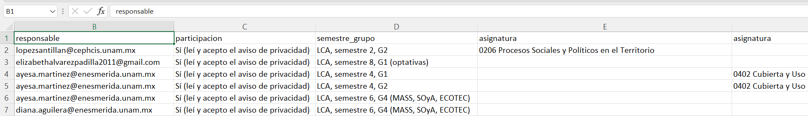
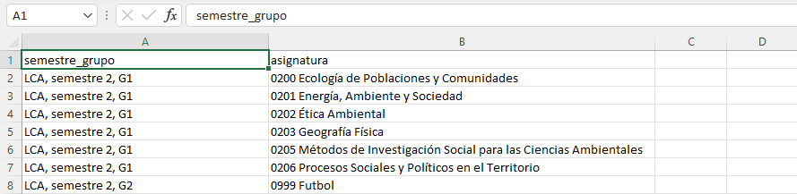

```{r setup, include=FALSE}
knitr::opts_chunk$set(echo = TRUE)
```

#  Instrucciones de uso
Esta es una aplicación web para agilizar el procesamiento de análisis de postulaciones para impartir docencia en las asignaturas de la Licenciatura en Ciencias Ambientales (LCA). Se basa en la información declarada en los formularios que cada postulante llenó durante la convocatoria de impartir docencia en la ENES. El uso de esta aplicación es para apoyar al Comité Académico (CA) en la toma de decisiones y **no representa** un instrumento estricto de selección de solicitudes. Es extensible a cualquier otro programa de estudios de la ENES Mérida que use un formulario de postulaciones idéntico al de LCA. 

## Paso 1: Preparación de datos
Cargar las respuestas del formulario en formato **Excel** tal como se lo entregó la *Secretaría Técnica de las Licenciaturas*. Este archivo debió recibir una edición prevía que consiste en adaptar el nombre de las columnas, quedando así:



Luego aplique `Ordenar solicitudes`. Esta función ordena toda la información del archivo, agrega un ID a cada solicitud, e identifica el *h-index* de cada postulante minando la información de **Google Académico**. Ejecute esta acción estando conectado a internet por cable LAN (evite conexión inhalábrica ya que puede haber fallas en la búsqueda del h-index de algunos profesores). Esta búsqueda puede demorar hasta 3 minutos. Luego se mostrará la base de datos ordenada en la pestaña *Postulaciones Ordenadas*, indicando el ID de cada solicitud y los datos de los profesores por cada postulación. Este archivo puede ser descargado en formato .csv (parte baja de la tabla, esquina izquierda). 

## Paso 2: Aplicación de rúbrica
Cargue la rúbrica  validada por el CA en formato **Excel**. Una vez cargado el archivo aplique el botón `Aplicar rúbrica`. Esta acción asignará puntos a cada profesor según la información académica cargada en el formulario. Toda la valoración y detalles se pueden ver en la tabla desplegada en la pestaña *Postulaciones valoradas en detalle*. Este archivo debe ser descargado en formato .csv (parte baja de la tabla, esquina izquierda), ya que será de utilidad para que el CA valide la información de las solicitudes con preferencia de adjudicación. 

El botón `Preseleccionar` totaliza los puntos de cada solicitud según el promedio de puntos de los profesor participantes. Las solicitudes se presentan según la asignatura, semestre y grupo en orden descendiente, con una columna de nombre *adjudicación* con dos posibles valores **VALIDAR POR CA** y **CONDICIONADA**. Este archivo debe ser descargado en formato .csv (parte baja de la tabla, esquina izquierda).

Seguidamente, cada CA analizará las solicitudes etiquetadas con **VALIDAR POR CA** y, en su caso, cambiar por **VALIDADA** (todo en mayúsculas). En caso haya objeciones a la pertinencia del o los perfíles de los postulantes preseleccionados, el CA cambiará la adjudicación por **NO ADJUDICADA** y analizará la siguiente solicitud con etiqueta **CONDICIONADA**. Si ninguna de las solicitudes cumple con los criterios académicos que el CA considera para la asignatura, debe escribir en la adjudicación **NO ADJUDICADA** o **CONDICIONADA**. Finalizado el análisis, el archivo se debe guardar en formato Excel, con el nombre que las identifique como validadas.  

## Paso 3: Datos para nómina
Cargar el archivo de asignaturas validadas en formato Excel. Ejecutar el botón `Adjudicados` para que se filtre la información generada en el paso 1 (*Postulaciones ordenadas*) y solo queden las solicitudes adjudicadas por el CA. Esta tabla se despliega en la pestaña *Adjudicados*. Esta tabla puede ser analizada para verificar que todo lo validado por el CA se refleja en la tabla desplegada. Una vez confirmado, se pude ejecutar el botón *Datos para nómina* que generará una tabla con toda la información personal que se requiere incluir en el documento de nombramientos que se presenta ante el CT y al Dpto de nómina.

## Paso 4: Asignaturas desiertas
Cargar el catálogo de asignaturas verificando que las columnas tengan estos nombres:



Noten que el archivo tiene solo dos columnas con nombres: *semestre_grupo* y *asignatura*, todo el minúscula y singular. Una vez cargado el archivo, ejecutar el botón `Identificar desiertas`. La lista de asignaturas (y grupos) desiertas se desplegará en la pestaña *Desiertas*.

# Desarrollo de la App
La aplicación se construyó en **Shiny** usando programación en **R**, todos los códigos fueron escritos por el **Prof. Edlin Guerra Castro, Coord. de la  Licenciatura en Ciencias Ambientales. ENES Mérida, UNAM**.


Versión de la aplicación 0.1.0
Usada para planificación del semestre 2023-1